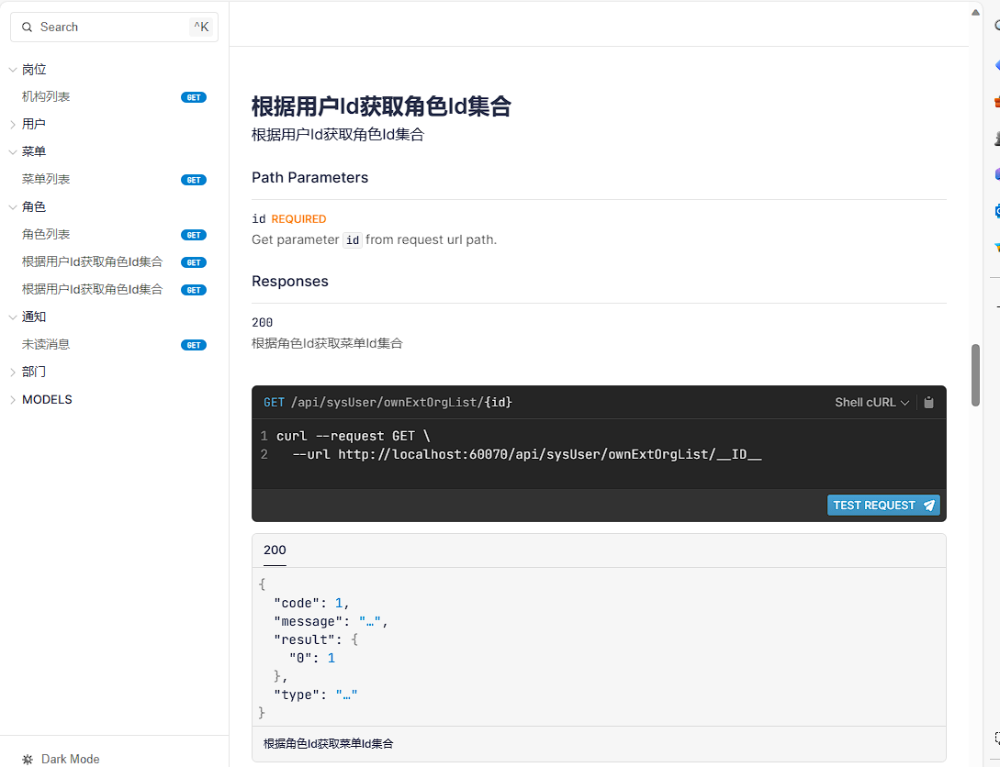

# Rust Web Api
[rust教程](https://course.rs/about-book.html)   
参考 [admincore](https://github.com/strongQ/AdminCode) 后端，编写rust web api，架子已经搭好，功能有待完善。    
[前端](https://github.com/strongQ/AdminCode/tree/main/Web) vue3

release编译后 11m
运行后占用内存 2.4m ，真tm的小啊。

# 框架
[Salvo](https://salvo.rs/zh-hans/)    
[Rbatis](https://rbatis.github.io/rbatis.io/#/v4/)

idgenerator （产生16位雪花id，适配vue前端）

# 已实现
1. 登录
2. 菜单
3. 用户管理

# api地址
/swagger   登录密码 admin admin2023
/scalar